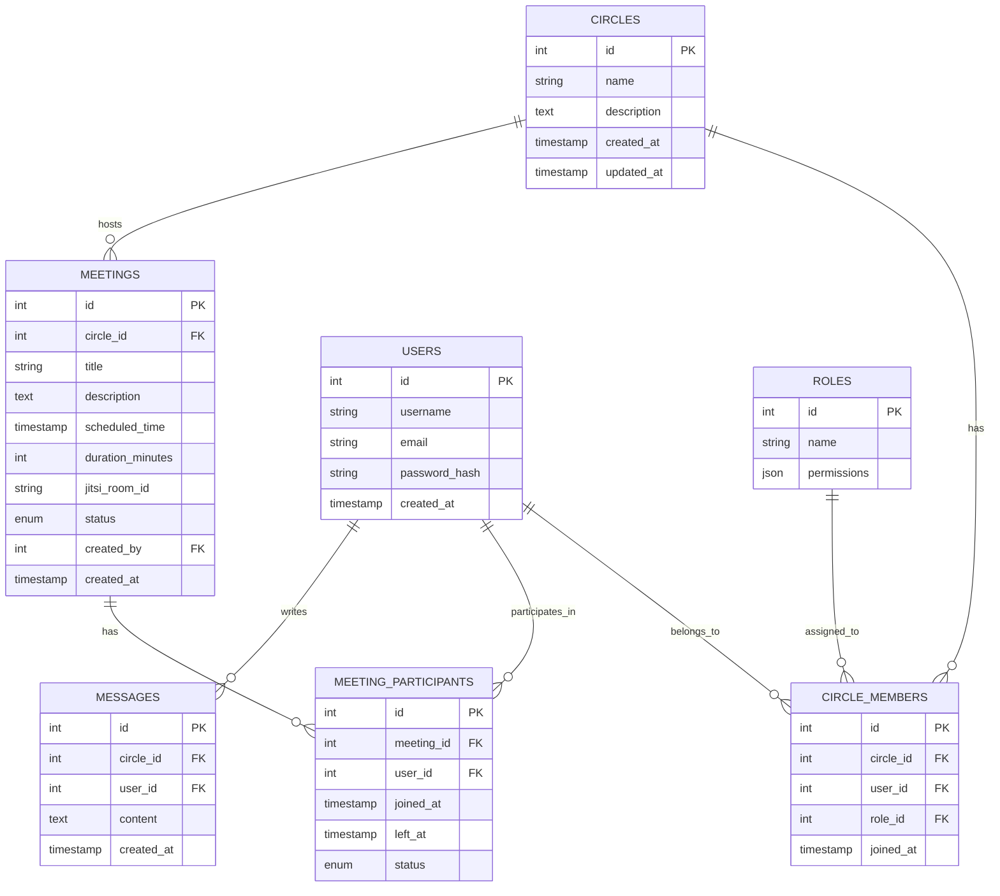

# InquiryCircle - Entity Relationship Diagram (ERD)

## Legend
- **PK**: Primary Key
- **FK**: Foreign Key
- **||--o{**: One-to-Many relationship
- **string**: Variable-length character data
- **text**: Long text data
- **int**: Integer number
- **timestamp**: Date and time
- **enum**: Enumerated type
- **json**: JSON data type for flexible data storage

## Relationship Details
1. **Circles to Circle Members**: One-to-Many (A circle can have many members)
2. **Users to Circle Members**: One-to-Many (A user can be a member of many circles)
3. **Circles to Meetings**: One-to-Many (A circle can have many meetings)
4. **Meetings to Meeting Participants**: One-to-Many (A meeting can have many participants)
5. **Users to Messages**: One-to-Many (A user can write many messages)
6. **Circles to Messages**: One-to-Many (A circle can have many messages)
7. **Roles to Circle Members**: One-to-Many (A role can be assigned to many circle members)

## Notes
- All tables include standard timestamps for creation/updates where appropriate
- Enums are used for status fields to ensure data integrity
- JSON fields are used where flexible data storage is beneficial
- Indexes should be created on all foreign keys for performance optimization
